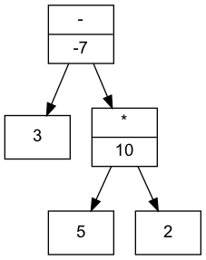

# term2dot

Calculator that computes a mathematical term given as input and exports the expression tree as Graphviz file.

## Features
* Basic arithmetic:
  * addition (+)
  * subtraction (-)
  * multiplication (*)
  * division (/)
  * raise to the power of (^)
* Brackets
* Standard functions (abs, sqrt)
* Exponential and logarithmic functions (exp, log)
* Trigonomic functions (cos, sin, tan)
* Hyperbolic functions (cosh, sinh, tanh)


## Installation Requirements
* bison
* flex
* C++ Compiler (e.g. g++)
* make utility (e.g. gmake)
* graphviz
* xdot (optional)

## Installation
The `calc` application is built in the source code directory with the command:
```
$ make
```

## Usage
Call `calc` with a mathematical term as an argument in order to generate a Graphviz file.
If no further arguments are given, the name of the output file is `term.dot`.
```
$ ./calc "3-5*2"
```
In order to use a different file use the option `-o`:
```
$ ./calc -o my_term.dot "3-5*2"
```
The resulting graph can be viewed with the `xdot` command:
```
$ xdot term.dot
```
Alternatively it can be converted into an image with the `dot` utility from the Graphviz package:
```
$ dot -Tpng term.dot -o term.png
```

